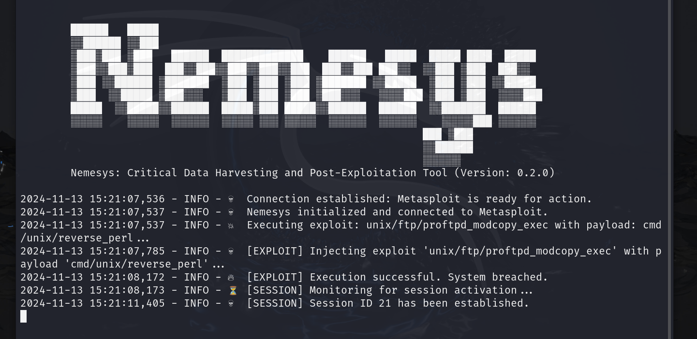
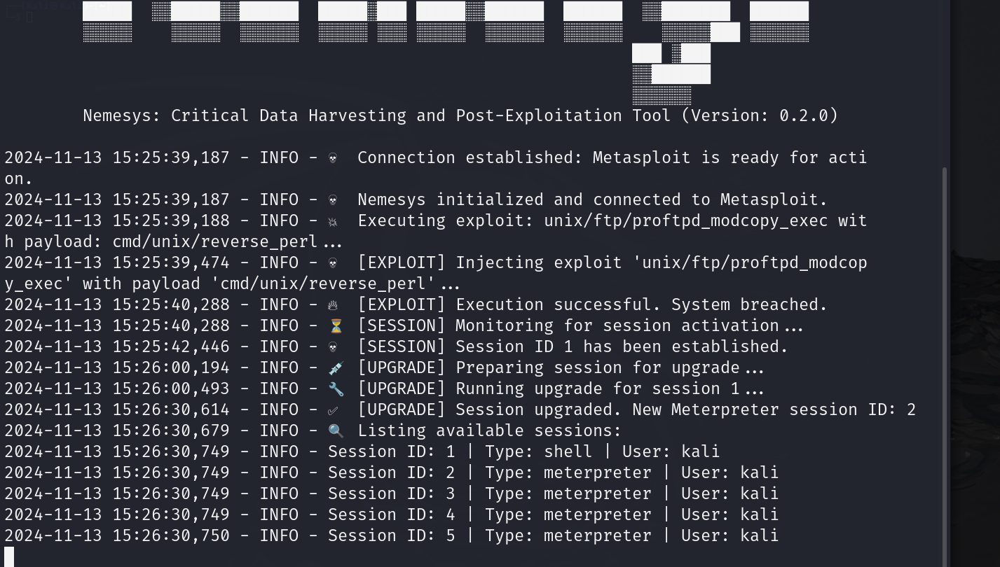
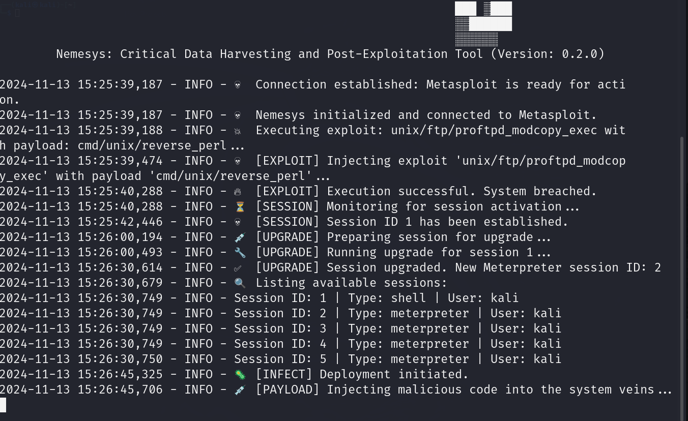
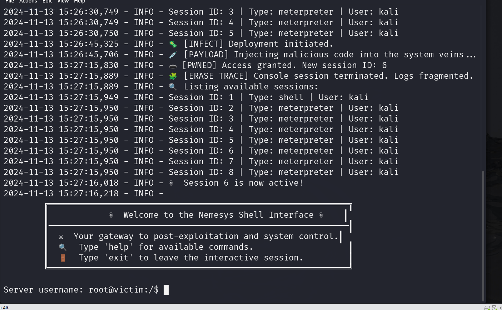
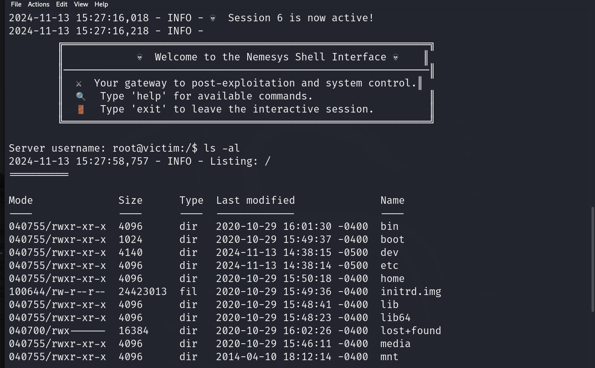
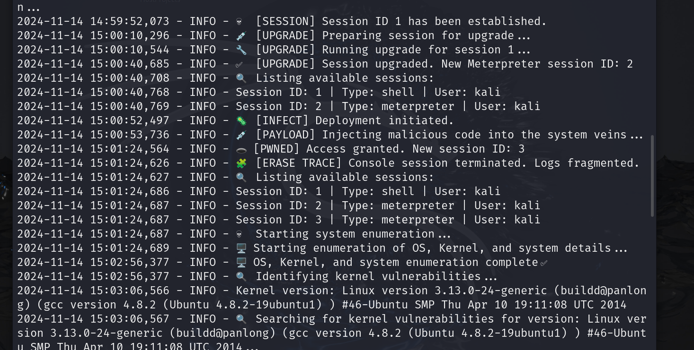
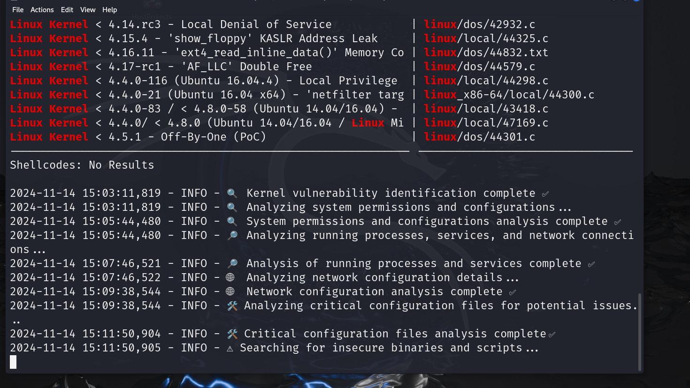
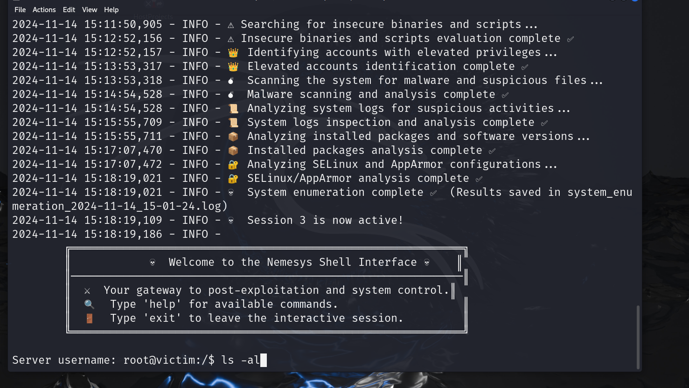
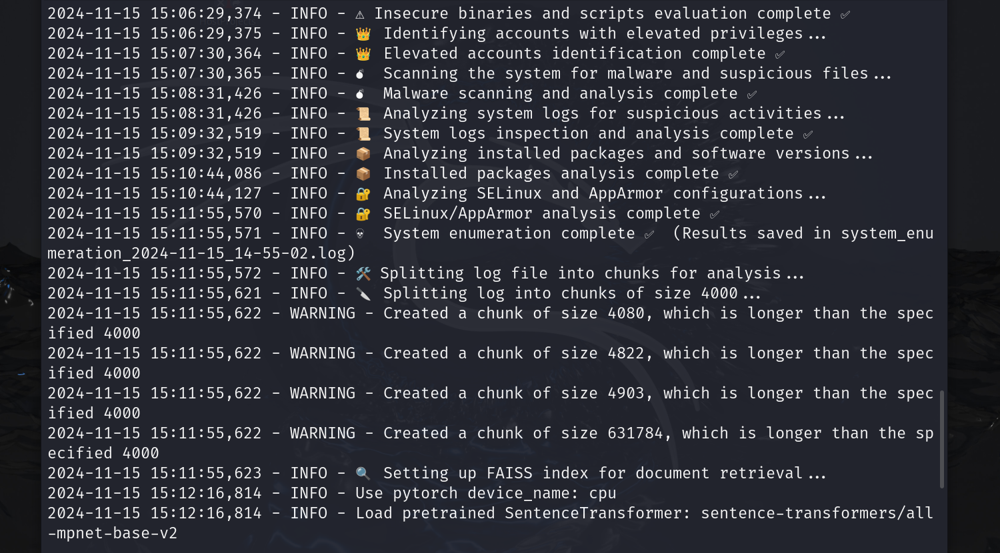
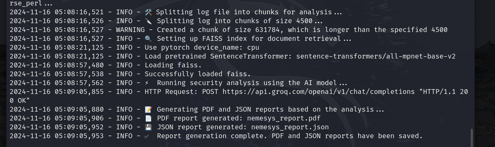

# 💀 **Nemesys**: ⚡ Critical Data Harvesting & 🛠️ Post-Exploitation Tool 🕵️‍♂️

**Nemesys** is an advanced exploitation and post-exploitation automation tool built on top of the Metasploit Framework. 🛠️ Designed for penetration testers and security researchers, it streamlines the process of targeting, exploiting, and deeply enumerating vulnerable systems. With a sleek dark-themed interface and powerful automation, **Nemesys** simplifies complex exploitation workflows, providing full control and visibility over compromised systems. ⚔️

🙏 I would like to express my sincere gratitude to [Santiago Hernández, a leading expert in Cybersecurity and Artificial Intelligence](https://www.udemy.com/user/shramos/). His outstanding course on **Cybersecurity and Ethical Hacking**, available on Udemy, was instrumental in the development of this project. The insights and techniques I gained from his course were invaluable in guiding my approach to cybersecurity practices. Thank you for sharing your knowledge and expertise!

### Disclaimer ⚠️
**Nemesys is designed as a learning and training tool** for applying Artificial Intelligence (AI) in the field of cybersecurity. Its primary purpose is to automate the process of generating detailed security reports based on system enumeration and vulnerability analysis. **Nemesys is intended for ethical and authorized use only**. Unauthorized use may result in severe legal consequences. Always ensure that you have proper authorization and are conducting your activities in a controlled, legal, and ethical environment, such as a lab setup or with explicit permission to use this tool on any system.


### Testing Information 🧪
All tests and exploitation workflows in **Nemesys** were conducted in a controlled environment using **Metasploitable Ubuntu**, a deliberately vulnerable machine designed for security testing and training. This testing was carried out in a dedicated **lab environment** to ensure ethical use and avoid unauthorized access to any external systems. The results of these tests demonstrate the tool’s effectiveness in identifying and exploiting vulnerabilities in a controlled, safe, and legal environment.

<p align="center">
  
  
  
</p>

<p align="center">
  
</p>

## 🚀✨ Key Features

- 🔍 **Automated Exploitation**: Execute Metasploit exploits effortlessly against target systems. Choose your desired exploit and payload, and let Nemesys automate the execution, session creation, and follow-up tasks.
- 🛡️ **Privilege Escalation**: Gain elevated access by leveraging built-in Metasploit modules for privilege escalation, enabling root or administrative control over the target system.
- ⬆️ **Session Upgrade to Meterpreter**: Automatically upgrades simple shell sessions to fully interactive Meterpreter sessions, unlocking additional post-exploitation capabilities such as file system browsing, keylogging, and pivoting.
- 💻 **Interactive Reverse Shell**: Establishes an interactive reverse shell with root or elevated privileges, enabling direct manual exploitation and in-depth system analysis.
- 🗂️ **System Critical Harvesting**: Conducts comprehensive system enumeration and data harvesting, extracting key details such as OS version, kernel information, network configuration, active processes, and user permissions.
- 🧠 **Intelligent Reporting with LLMs**: Utilizes **LangChain** integrated with **Groq** for cloud-based LLM processing. Generates a detailed analysis of the target system, including insights on potential next steps, vulnerability assessment, and remediation recommendations.
- 🤖 **Integration with Metasploit RPC**: Direct connection to Metasploit’s RPC interface allows efficient management of active sessions, payloads, and exploit modules, optimizing the post-exploitation workflow.
- 🛠️ **User-Friendly and Extensible**: Built with an intuitive interface for streamlined usage. Easily customizable to fit specific exploitation scenarios and to integrate with other tools in your security arsenal.


## 🔧💻 Requirements

- 🐍 **Python 3.8+**: Required for running the Nemesys scripts.
- 🦾 **Metasploit Framework**: Installed and configured for exploit execution.
- ☁️ **LangChain** and **Groq**: Access for cloud-based LLM processing with Groq's powerful AI model.
- 🔑 **Root or Admin Privileges**: Necessary for full functionality and executing privileged exploits.
- 🧠 **FAISS**: Set up for efficient similarity search and retrieval in the RAG (Retrieval-Augmented Generation) process.
- 🤗 **HuggingFaceEmbeddings**: Required for embedding documents and enhancing the RAG technique for optimal security analysis.

<p align="center">
  
</p>

## 🔧🧩 **Component Breakdown**: 🔍 Exploring the Building Blocks of Nemesys ⚙️

Nemesys is designed with a modular architecture, where each component has a distinct responsibility, making the exploitation and post-exploitation process efficient and streamlined. Below is a detailed overview of each core component:

### 1. **MetasploitClient** 🕵️‍♂️

The **MetasploitClient** serves as the connection interface between Nemesys and the Metasploit RPC API.

- **Responsibilities**:
  - Establishes and manages the connection to the Metasploit RPC server.
  - Handles secure API requests with SSL support.
  - Provides a client object used by other components for unified Metasploit interactions.

- **Integration**:
  - Initiated during the setup of Nemesys to validate connectivity.
  - Essential for all interactions with Metasploit modules across components.

<p align="center">
  
</p>

### 2. **ExploitManager** 💥

The **ExploitManager** handles the execution of exploits against target systems using Metasploit.

- **Responsibilities**:
  - Executes chosen exploit modules with specified payloads.
  - Configures options for both exploit and payload modules (e.g., `RHOSTS`, `LPORT`).
  - Tracks exploit attempts using UUIDs for result monitoring.

- **Integration**:
  - Triggered by the `run_attack()` method to start the exploitation phase.
  - Passes exploit UUIDs to the **SessionManager** for session tracking.

### 3. **SessionManager** 🔄

The **SessionManager** is in charge of managing sessions, including session upgrades and tracking active sessions.

- **Responsibilities**:
  - Retrieves session IDs based on the exploit UUID returned by the **ExploitManager**.
  - Upgrades standard shell sessions to Meterpreter sessions for enhanced capabilities.
  - Lists and manages active sessions for efficient exploitation.

- **Integration**:
  - Central to the transition between the exploitation and post-exploitation phases.
  - Handles session upgrades automatically and tracks session IDs.

### 4. **PrivilegeEscalationManager** 🔓

The **PrivilegeEscalationManager** focuses on elevating privileges after a session has been established.

- **Responsibilities**:
  - Identifies suitable privilege escalation exploits based on system information.
  - Executes privilege escalation modules (e.g., kernel exploits) to gain elevated access.
  - Verifies the success of privilege escalation attempts.

- **Integration**:
  - Optionally invoked in the `run_attack()` method if a privilege escalation module is specified.
  - Collaborates with the **SystemEnumerator** to determine potential escalation paths.

### 5. **ShellInterface** 🖥️

The **ShellInterface** provides an interactive shell for direct command execution on compromised targets.

- **Responsibilities**:
  - Opens an interactive shell session (Meterpreter or standard shell) for manual exploitation.
  - Supports system command execution, script imports, and file transfers.
  - Offers a user-friendly interface for further post-exploitation tasks.

- **Integration**:
  - Invoked at the end of the `run_attack()` process for hands-on interaction with the compromised system.
  - Adjusts the shell type based on the session capabilities (e.g., upgraded Meterpreter session).

<p align="center">
  
</p>

<p align="center">
  
</p>


### 6. **SystemEnumerator** 🔍

The **SystemEnumerator** is designed to gather extensive information about the compromised system for analysis.

<p align="center">
  
</p>

- **Responsibilities**:
  - Collects system details such as OS version, network interfaces, installed software, and running processes.
  - Identifies potential vulnerabilities and misconfigurations using integrated tools like `searchsploit`.
  - Generates initial system assessment reports, aiding in further exploitation decisions.

- **Integration**:
  - Called after session establishment and upgrade to provide critical system information.
  - Supplies data to the **PrivilegeEscalationManager** for identifying privilege escalation opportunities.
  - Capable of generating advanced reports using **LangChain** with LLM analysis through Groq Cloud.

<p align="center">
  
</p>

<p align="center">
  
</p>


### 7. **SecurityAnalyzer** 🛡️

The **SecurityAnalyzer** component is responsible for analyzing the system enumeration log and generating comprehensive security reports using advanced AI techniques.

- **Responsibilities**:
  - **Log Analysis**: The **SecurityAnalyzer** processes system enumeration logs received from the **SystemEnumerator** or another log source.
  - **Retrieval-Augmented Generation (RAG)**: Uses **FAISS** for document retrieval and **HuggingFaceEmbeddings** for embedding the logs, allowing the AI model to generate insights based on the retrieved information.
  - **Report Generation**: Creates professional security reports summarizing vulnerabilities, misconfigurations, and providing actionable recommendations.
  - **Format Generation**: Outputs reports in both **PDF** and **JSON** formats, making the insights accessible for both human review and further automation.

- **Integration**:
  - Invoked after the **SystemEnumerator** process to analyze the system log and generate security reports based on the collected data.
  - Leverages the AI model in **LangChain** via **Groq Cloud** for processing and generating tailored security insights.
  - Plays a crucial role in the final analysis phase by providing detailed and actionable recommendations for improving the security posture of the target system.

<p align="center">
  
</p>

<p align="center">
  
</p>

This modular structure ensures that each component performs its role effectively, contributing to a cohesive and efficient exploitation workflow in Nemesys.

## 🧩 Workflow Overview

The main exploitation process in Nemesys involves the following steps:

1. **Initialization**:
   - Connects to Metasploit using **MetasploitClient** to establish a secure connection to the RPC server.

2. **Exploitation**:
   - Executes the chosen exploit and payload using **ExploitManager**.
   - Retrieves the session ID via **SessionManager** to track exploit progress.

3. **Session Management**:
   - Upgrades the session for enhanced control (e.g., Meterpreter shell) using **SessionManager**.

4. **Privilege Escalation** (Optional):
   - Attempts privilege escalation using **PrivilegeEscalationManager** to gain higher-level access.

5. **System Enumeration**:
   - Gathers extensive system information (OS details, running services, vulnerabilities) using **SystemEnumerator**.
   - The **SystemEnumerator** outputs logs with system data that can later be analyzed.

6. **Security Analysis**:
   - The generated system enumeration log is fed into the **SecurityAnalyzer**.
   - **SecurityAnalyzer** uses advanced techniques (RAG with **FAISS** and **HuggingFaceEmbeddings**) to process the log and generate a detailed security report.

7. **Interactive Shell**:
   - Provides a hands-on interactive shell through **ShellInterface** for manual exploitation, based on the elevated session or analysis results.

## Installation ⚙️
To use Nemesys, you'll need to have the necessary dependencies installed and be able to run the Python script from your terminal.

Clone the repository to your machine:

```bash
git clone https://github.com/sergio11/nemesys.git
```

Navigate to the directory:

```bash
cd nemesys
```
Install dependencies:

```bash
pip install -r requirements.txt
```

## Usage Examples 🚀

Once everything is set up, you can invoke the **Nemesys** tool using the `nemesys_cli.py` script. Below are several examples of how to use it, along with explanations.

### 1. Basic Exploit Invocation 💥

This command runs an exploit with a specific payload and sets up reverse connections for the exploit to work.

#### Description 📜:
- `--password "password"`: The password used for authentication on the target system. 🔑
- `--exploit_name "unix/ftp/proftpd_modcopy_exec"`: The specific exploit you want to run, targeting a vulnerability in ProFTPd. 📡
- `--payload_name "cmd/unix/reverse_perl"`: The payload that will execute after the exploit is successful (reverse shell using Perl). 🖥️
- `--rhosts "192.168.11.128"`: The target machine's IP address for the exploit. 🎯
- `--sitepath "/var/www/html"`: The path to the website directory (used in web-based exploits). 🌍
- `--lhost "192.168.11.129"`: Your machine's IP address where the reverse shell will connect back. 🔙
- `--lport 4445`: The local port on your machine that the reverse shell will connect to. ⚙️
- `--privilege_exploit "linux/local/cve_2021_4034_pwnkit_lpe_pkexec"`: A local privilege escalation exploit to gain root access on the target. 🔓
- `--target "192.168.11.128"`: The IP address of the target machine to attack. 🎯

#### Expected Outcome 🏆:
Once you execute the command, **Nemesys** will attempt to exploit the ProFTPd vulnerability, trigger a reverse shell on your local machine, and then escalate privileges using the `pwnkit` local privilege escalation vulnerability.

---

### 2. Using a Different Payload 🚨

To use a different payload (e.g., `cmd/unix/reverse_bash`), simply modify the `--payload_name` parameter.

#### Change Explained 🔄:
- `--payload_name "cmd/unix/reverse_bash"`: Swapping the payload to a Bash reverse shell. 💥

---

### 3. Exploiting Without Privilege Escalation 🔓

If you don't need to perform privilege escalation, simply omit the `--privilege_exploit` parameter.

#### What Happens? 🔍
This command will perform the exploit and create a reverse shell without attempting to escalate privileges. It's useful when you only need a foothold without full system control. 💥

## ⚠️ Disclaimer
**Nemesys is designed as a learning and training tool** for applying Artificial Intelligence (AI) in the field of cybersecurity. Its primary purpose is to automate the process of generating detailed security reports based on system enumeration and vulnerability analysis. **Nemesys is intended for ethical and authorized use only**. Unauthorized use may result in severe legal consequences. Always ensure that you have proper authorization and are conducting your activities in a controlled, legal, and ethical environment, such as a lab setup or with explicit permission to use this tool on any system.

All tests and exploitation workflows in **Nemesys** were conducted in a controlled environment using **Metasploitable Ubuntu**, a deliberately vulnerable machine designed for security testing and training. This testing was carried out in a dedicated **lab environment** to ensure ethical use and avoid unauthorized access to any external systems. The results of these tests demonstrate the tool’s effectiveness in identifying and exploiting vulnerabilities in a controlled, safe, and legal environment.

## 🛡️ Legal
The author of Nemesys is not responsible for any misuse or damage caused by this tool. Use responsibly and comply with all local laws.

## 🖤 Contributing
Contributions are welcome! Feel free to submit issues or pull requests to help improve Nemesys.

## 💬 Contact
For any questions, suggestions, or feedback, reach out via GitHub or email.

## 🏴‍☠️ Happy Hacking!
